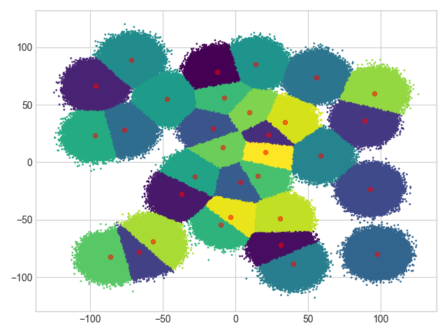

# 15618 Project - Parallelized K-Means clustering

## Build
Run `make` from the root folder. This will build a binary `kmeans` that is the main entrypoint for execution.

## Benchmarks

The available options are:
- -in: path to input file
- -out: path to output file
- -k: number of cluster
- -n: number of data points
- -omp: run K-Means algorithm parallelized using OpenMP
- -mpi: run K-Means algorithm parallelized using MPI
- -cuda: run K-Means algorithm parallelized using MPI

## Test data

Test data was generated with make_blobs. There generated test files used for performance benchmarking are:
- small.csv (1.6 million data points, 12 clusters)
- large.csv (16 million data points, 32 clusters)

## Benchmarking and comparison

to be updated

## Analysis

to be updated
